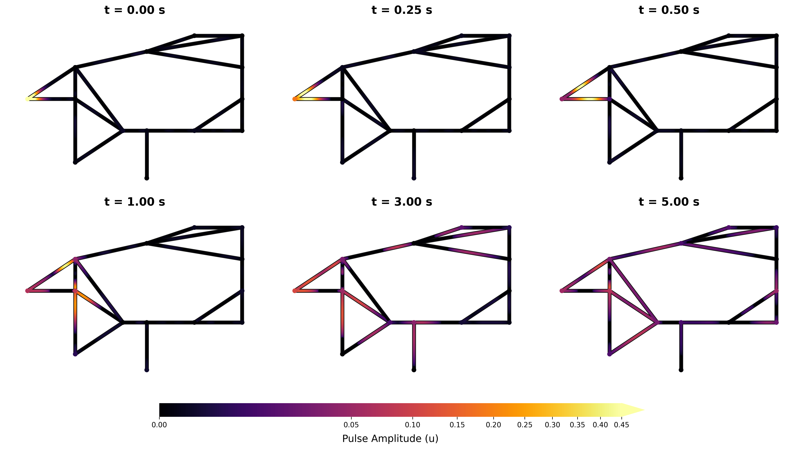

# QGPINNs: A Physics-Informed Neural Network Framework for Nonlocal Differential Equations on Quantum Graphs

[](https://pytorch.org/)
[](LICENSE)
[](https://arxiv.org/abs/2608.28589)

**QGPINNs** is a PyTorch-based deep learning framework designed to solve fractional differential equations defined on quantum graphs. It natively supports two classes of nonlocal problems, multi-order fractional elliptic problems and time-fractional evolution equations. The framework however remains flexible enough to compute the numerical solutions to a wider range of differential equations embedded on quantum graphs. The framework separates the core QGPINNs engine (network architecture, fractional operator assembly, vertex coupled loss term) from run scripts, which define the governing physics and graph topology for each problem.

Full methodology, derivations, and results are described in our paper:

> Vaibhav Mehandiratta, Saket Ramchandra. **QGPINNs: A Physics-Informed Neural Network Framework for Nonlocal Differential Equations on Quantum Graphs.** arXiv:2608.28589, 2026. [[arXiv](https://arxiv.org/abs/2608.28589)]

---

## Key Features

* **Modular Architecture**: Complete separation between the core neural network engine (`Engine/`) and user-defined graph physics (`Section_3_Run_Scripts/`, `Section_5_Run_Scripts/`).
* **Fractional Caputo Operator**: Computed within the engine using $L1$ and $L2\text{-}1_{\sigma}$ schemes.
* **Graph Vertex Coupling**: Enforcement of Kirchhoff-Neumann transmission conditions and continuity constraints across junctions.
* **Singularity-Capturing Feature**: Learnable auxiliary feature $Z(t) = t^\xi$ to capture initial singularities.
* **Spectral Bias Mitigation**: Random Fourier Feature embeddings to resolve high frequency spatial oscillations.
* **Dynamic Loss Balancing**: Integrated adaptive weighting mechanisms (BDMM, gradient-ratio, and fixed weight strategies).
* **Inverse Problem Solver**: Built-in support for recovering fractional operator orders ($\alpha, \beta$) and physical parameters from noisy observation data.

---

## Repository Structure

```text
QGPINNs/
├── Engine/
│   ├── __init__.py
│   └── QGPINNs_Engine.py       # Core solver engine: PINN architecture, fractional matrix assembly, vertex coupling
├── Section_3_Run_Scripts/      # Theoretical benchmarks & ablation studies (adaptive λ, Fourier features, Z(t))
├── Section_5_Run_Scripts/      # Applications: tadpole graph, drainage network, IEEE 14-bus topology
├── requirements.txt
├── LICENSE
└── README.md
```

---

## Installation

```bash
git https://github.com/Saket2006/QGPINNs-Framework-to-solve-FDEs-on-Quantum-Graphs.git
cd QGPINNs-Framework-to-solve-FDEs-on-Quantum-Graphs
python3 -m venv venv
source venv/bin/activate      # Windows: venv\Scripts\activate
pip install -r requirements.txt
```

Requires Python 3.9+. GPU (CUDA) is used automatically if available; falls back to CPU otherwise.

## Usage

Each run script in `Section_3_Run_Scripts/` and `Section_5_Run_Scripts/` is self-contained and imports the engine directly:

```bash
cd Section_5_Run_Scripts
python Problem_1.py
```

Minimal example using the engine directly:

```python
from QGPINNs_Engine import EllipticPINNSolver, device

solver = EllipticPINNSolver(graph, physics)
solver.set_architecture(hidden_layers=4, hidden_dim=96, use_fourier=True)
solver.set_mesh(pts_per_unit=250, grading_factor=1.5)
solver.set_constraints('soft')
solver.compile()
solver.train_multistart(epochs=8000, n_starts=3)
solver.report_l2(exact_funcs)
```

See the run scripts for full graph/physics definitions for each benchmark problem.

## Results

Validation of Telegrpah Equation system embedded on IEEE-14 Bus network (`Section_5_Run_Scripts/problem_4.py`).

### Physical-Consistency and Energy Diagnostics Across Fractional Orders γ

| Metric / Quantity | γ = 0.50 | γ = 0.75 | γ = 1.00 |
|---|---|---|---|
| **Initial-Boundary Conditions** | | | |
| Initial Pulse Relative RMS Error | 0.388% | 0.558% | 0.467% |
| Initial Pulse L₂ Error | 4.206 × 10⁻⁴ | 6.038 × 10⁻⁴ | 5.057 × 10⁻⁴ |
| Initial Velocity L₂ Error | 1.516 × 10⁻³ | 2.488 × 10⁻³ | 2.324 × 10⁻³ |
| **Network Transmission Constraints** | | | |
| Junction Continuity L₂ Error | 3.707 × 10⁻³ | 3.872 × 10⁻³ | 2.493 × 10⁻³ |
| Physical Kirchhoff Flux L₂ Residual | 9.375 × 10⁻⁴ | 1.494 × 10⁻³ | 1.109 × 10⁻³ |
| Grounded Terminal (Node 0) L₂ Residual | 1.598 × 10⁻³ | 1.804 × 10⁻³ | 1.300 × 10⁻³ |
| **Global Energy Physics** | | | |
| Initial Network Energy E(0) | 3.728 | 3.726 | 3.737 |
| Final Network Energy E(T_max) | 0.376 | 0.082 | 0.020 |
| Energy Fraction Remaining (E_final / E_initial) | 10.09% | 2.21% | 0.53% |
| Energy Monotonicity Fraction | 98.74% | 98.11% | 98.74% |
| Late-Time Log-Log Slope | −1.564 | −2.599 | −3.523 |
| **Pulse Propagation** | | | |
| Peak Surge Amplitude (t = 0.00 s) | 1.001 | 1.001 | 1.002 |
| Peak Surge Amplitude (t = 0.05 s) | 0.492 | 0.487 | 0.483 |
| Peak Surge Amplitude (t = 0.10 s) | 0.463 | 0.446 | 0.427 |
| Peak Surge Amplitude (t = 0.20 s) | 0.412 | 0.373 | 0.335 |
| Peak Surge Amplitude (t = 1.00 s) | 0.116 | 0.068 | 0.043 |

Propogation of the pulse with time(γ = 0.50)



Full quantitative results, ablations, and comparisons against baseline schemes are in the paper.

---

## Citation

If you use this code, please cite:

```bibtex
@article{mehandiratta2026qgpinns,
  title   = {QGPINNs: A Physics-Informed Neural Network Framework for Nonlocal Differential Equations on Quantum Graphs},
  author  = {Mehandiratta, Vaibhav and Ramchandra, Saket},
  journal = {arXiv preprint arXiv:2608.28589},
  year    = {2026}
}
```

## License

MIT — see [LICENSE](LICENSE).